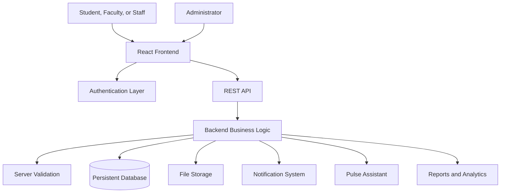
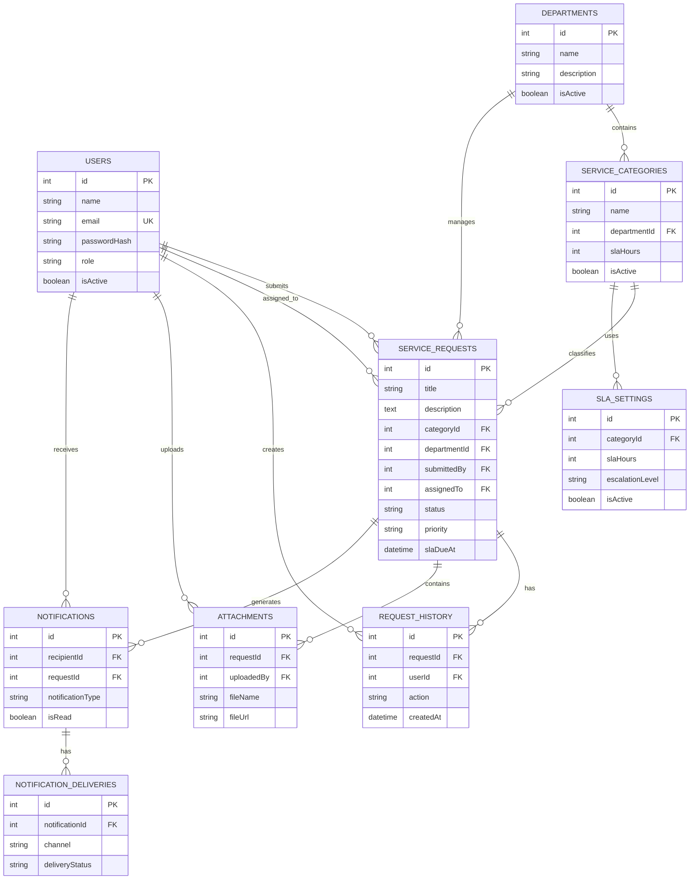

# CampusPulse: Real-Time Student Service Management System

## 1. Title and Project Overview

### Project Title

**CampusPulse: Real-Time Student Service Management System**

### Project Overview

CampusPulse is a full-stack web-based student service and complaint management system developed for colleges and educational institutions.

The system allows students, faculty, staff, maintenance personnel, department heads, and administrators to submit, manage, assign, track, resolve, and monitor campus service requests.

Students and staff can report issues related to electricity, plumbing, internet, cleanliness, classrooms, hostels, security, transport, furniture, laboratories, libraries, medical facilities, cafeterias, and other campus services.

The system supports user registration, secure authentication, role-based access, service request CRUD operations, file attachments, SLA deadlines, escalation workflows, notifications, administrator management screens, reports, analytics, and an AI assistant named **Pulse Assistant**.

CampusPulse is designed according to academic full-stack and CRUD application requirements.

---

## 2. Problem Statement

Many colleges handle student service complaints through paper forms, phone calls, verbal communication, messaging applications, or informal conversations.

These manual methods create several problems:

- Service requests can be lost or forgotten.
- Students cannot easily track request progress.
- Administrators do not have a centralized request database.
- Maintenance staff may not know which issues are urgent.
- There is no clear assignment process.
- Overdue service requests may not be escalated.
- Students may not receive timely updates.
- Request history is difficult to maintain.
- Reports must be prepared manually.
- Department performance cannot be monitored accurately.

CampusPulse solves these problems by providing a centralized digital service-request platform with role-based access, request tracking, status updates, SLA management, notifications, reports, and assistant support.

---

## 3. Objectives

The main objectives of CampusPulse are:

1. To provide an online platform for reporting campus service issues.
2. To implement complete Create, Read, Update, and Delete operations.
3. To allow students and staff to track service request progress.
4. To provide role-based access for different campus users.
5. To allow administrators to manage users, departments, and service categories.
6. To assign service requests to responsible maintenance staff.
7. To support image and document attachments.
8. To implement SLA deadlines for service resolution.
9. To escalate overdue service requests.
10. To provide in-app notifications.
11. To maintain request history and resolution details.
12. To provide reports and dashboard analytics.
13. To include an AI assistant named Pulse Assistant.
14. To provide REST API endpoints for academic demonstration.
15. To provide a responsive interface for desktop, tablet, and mobile devices.
16. To provide complete documentation for GitHub submission.

---

## 4. Target Users

CampusPulse supports the following users:

- Students
- Faculty
- Non-teaching staff
- Maintenance staff
- Department heads
- Administrators
- Super administrators
- Principal
- Vice principal

### Student Permissions

Students can:

- Create an account.
- Log in and log out.
- Submit service requests.
- View their own requests.
- Edit eligible requests.
- Upload attachments.
- Track request status.
- View notifications.
- Update their profile.

### Faculty and Staff Permissions

Faculty and staff can:

- Submit service requests.
- View their own requests.
- View assigned requests.
- Track service progress.
- Add permitted updates.
- Receive notifications.

### Maintenance Staff Permissions

Maintenance staff can:

- View assigned service requests.
- Update work progress.
- Add work notes.
- Upload supporting evidence.
- Add resolution details.
- Mark assigned work as completed.

### Department Head Permissions

Department heads can:

- View department requests.
- Assign service requests.
- Review progress.
- Monitor department performance.
- View department reports.

### Administrator Permissions

Administrators can:

- View all service requests.
- Assign requests.
- Update request status.
- Manage users.
- Manage departments.
- Manage service categories.
- Configure SLA hours.
- Escalate overdue requests.
- View request history.
- Manage notifications.
- Delete requests when authorized.

### Super Administrator Permissions

Super administrators can:

- Manage administrator permissions.
- Activate or deactivate users.
- Manage system settings.
- View all reports and system records.

### Principal and Vice Principal Permissions

Principal and vice principal users can:

- View authorized reports.
- Monitor unresolved requests.
- Review high-priority requests.
- Review overdue requests.
- Monitor service performance.

---

## 5. Technology Stack

### Frontend

- React
- TypeScript
- HTML
- CSS
- Vite
- Responsive design
- Component-based interface
- Client-side form validation

### Backend

- Node.js
- Express
- TypeScript
- REST API
- Server-side validation
- Role-based authorization
- Secure session management

### Database

- PostgreSQL, MySQL, or Firebase Firestore
- Persistent storage
- Database relationships or equivalent document references
- Database migrations where supported

### Authentication

- Email and password registration
- Secure password hashing
- Session-based authentication
- HTTP-only cookies
- Protected routes
- Role-based authorization

### AI Assistant

- Pulse Assistant
- Natural language service-request drafting
- Category suggestions
- Help Center guidance
- Authorized request summaries

### Testing

- Vitest
- Authentication tests
- Validation tests
- CRUD tests
- Permission tests
- REST API tests
- Notification tests
- SLA and escalation tests

### Development Tools

- VS Code
- Git
- GitHub
- npm
- Postman
- Google AI Studio
- Google Cloud Run

---

## 6. System Architecture

CampusPulse follows a full-stack client-server architecture.

The frontend provides the user interface. The backend manages authentication, authorization, validation, service-request processing, REST endpoints, database access, notifications, SLA processing, file attachments, reports, and the Pulse Assistant.



### Application Workflow

1. A user opens the CampusPulse application.
2. The user registers or logs in.
3. The server validates the credentials.
4. A secure session is created.
5. The user is redirected to the appropriate dashboard.
6. The user submits or views service requests.
7. The backend validates request data.
8. The service request is saved in persistent storage.
9. The system calculates the SLA deadline.
10. Responsible staff receive notifications.
11. Maintenance staff update work progress.
12. Administrators monitor assignments and deadlines.
13. Resolved requests receive resolution details.
14. Request history records important changes.
15. Overdue requests can be escalated.

### Authorization

Authorization is enforced on the backend.

The server verifies:

- User authentication.
- User role.
- Request ownership.
- Department access.
- Assignment permissions.
- Administrator permissions.
- Attachment access.
- Valid request data.

Frontend role checks are used for interface display only and are not relied upon as the main security mechanism.

---

## 7. Database Design

CampusPulse uses persistent data storage for users, service requests, departments, categories, request history, attachments, notifications, and SLA settings.

### Users

Stores user accounts and profile information.

Important fields:

- id
- name
- email
- passwordHash
- role
- phone
- department
- designation
- studentOrEmployeeId
- hostel
- bio
- isActive
- createdAt
- updatedAt
- lastLogin

### Departments

Stores college departments and responsible service divisions.

Important fields:

- id
- name
- description
- contactEmail
- isActive
- createdAt
- updatedAt

### Service Categories

Stores service-request categories and SLA settings.

Important fields:

- id
- name
- description
- departmentId
- slaHours
- isActive
- createdAt
- updatedAt

### Service Requests

Stores campus service issues.

Important fields:

- id
- title
- description
- categoryId
- departmentId
- submittedBy
- assignedTo
- location
- building
- room
- priority
- status
- slaDueAt
- workNotes
- resolutionDetails
- createdAt
- updatedAt
- closedAt

### Request History

Stores important service-request changes.

Important fields:

- id
- requestId
- userId
- action
- oldValue
- newValue
- notes
- createdAt

### Attachments

Stores file metadata and secure storage references.

Important fields:

- id
- requestId
- uploadedBy
- fileName
- fileType
- fileSize
- storageKey
- fileUrl
- createdAt

Raw file content is not stored directly in normal database columns.

### Notifications

Stores in-app notifications.

Important fields:

- id
- recipientId
- requestId
- notificationType
- message
- isRead
- createdAt

### Notification Deliveries

Stores notification delivery information.

Important fields:

- id
- notificationId
- channel
- deliveryStatus
- deliveredAt
- errorMessage

### SLA Settings

Stores service-level agreement configuration.

Important fields:

- id
- categoryId
- slaHours
- escalationLevel
- isActive
- createdAt
- updatedAt

### Entity Relationship Diagram



---

## 8. User Interface Screenshots

Create a screenshot folder:

```text
docs/screenshots/
```

Recommended screenshot names:

```text
login.png
register.png
dashboard.png
request-list.png
submit-request.png
request-details.png
notifications.png
profile.png
admin-dashboard.png
user-management.png
department-management.png
category-management.png
pulse-assistant.png
```

### Login Page

The login page allows registered users to securely access CampusPulse.


### Registration Page

The registration page allows new users to create accounts without administrator approval.


### Dashboard

The dashboard displays request statistics, recent requests, notifications, priority information, and SLA performance.


### Service Request List

The request list displays service requests with search, filtering, status, priority, category, department, and assignment information.


### Submit Service Request

The submission form allows users to enter a title, description, category, department, location, priority, and attachment.


### Request Details

The request details page displays the complete request record, current status, SLA deadline, history, attachments, work notes, and resolution details.


### Notifications

The notifications page displays assignments, status changes, escalations, resolutions, and other system messages.


### Profile

The profile page allows users to update their personal and campus information.


### Administrator Dashboard

The administrator dashboard provides user management, department management, category management, assignments, SLA controls, and analytics.


### Pulse Assistant

Pulse Assistant helps users draft requests, understand the service process, and access Help Center information.


---

## 9. API Endpoint Documentation

All API endpoints return JSON responses.

### Authentication Endpoints

| Method | Endpoint | Description |
|---|---|---|
| POST | `/api/auth/register` | Register a new user |
| POST | `/api/auth/login` | Log in a user |
| POST | `/api/auth/logout` | Log out the current user |
| GET | `/api/auth/me` | Get the current authenticated user |

### Service Request Endpoints

| Method | Endpoint | Description |
|---|---|---|
| POST | `/api/requests` | Create a service request |
| GET | `/api/requests` | List service requests |
| GET | `/api/requests/:id` | View one service request |
| PUT | `/api/requests/:id` | Replace request data |
| PATCH | `/api/requests/:id` | Update selected request fields |
| DELETE | `/api/requests/:id` | Delete a service request |

### Department Endpoints

| Method | Endpoint | Description |
|---|---|---|
| POST | `/api/departments` | Create a department |
| GET | `/api/departments` | List departments |
| PUT | `/api/departments/:id` | Update a department |
| DELETE | `/api/departments/:id` | Delete a department |

### Category Endpoints

| Method | Endpoint | Description |
|---|---|---|
| POST | `/api/categories` | Create a service category |
| GET | `/api/categories` | List categories |
| GET | `/api/categories/:id` | View one category |
| PUT | `/api/categories/:id` | Update a category |
| DELETE | `/api/categories/:id` | Delete a category |

### User Endpoints

| Method | Endpoint | Description |
|---|---|---|
| GET | `/api/users` | List users |
| GET | `/api/users/:id` | View one user |
| PUT | `/api/users/:id` | Update a user |

### Notification Endpoints

| Method | Endpoint | Description |
|---|---|---|
| GET | `/api/notifications` | List notifications |
| PATCH | `/api/notifications/:id/read` | Mark notification as read |

### Attachment Endpoints

| Method | Endpoint | Description |
|---|---|---|
| POST | `/api/requests/:id/attachments` | Upload an attachment |
| GET | `/api/requests/:id/attachments` | List request attachments |
| DELETE | `/api/attachments/:id` | Delete an attachment |

### SLA and Escalation Endpoints

| Method | Endpoint | Description |
|---|---|---|
| PATCH | `/api/requests/:id/sla` | Update request SLA |
| POST | `/api/requests/:id/escalate` | Escalate a request |
| POST | `/api/sla/scan` | Scan for overdue requests |

### Report Endpoints

| Method | Endpoint | Description |
|---|---|---|
| GET | `/api/reports/summary` | Get service summary |
| GET | `/api/reports/requests` | Get service-request reports |

### HTTP Status Codes

| Status Code | Meaning |
|---|---|
| 200 | Successful read or update |
| 201 | Successful creation |
| 204 | Successful deletion |
| 400 | Validation error |
| 401 | Authentication required |
| 403 | User is not authorized |
| 404 | Record not found |
| 409 | Duplicate record |
| 500 | Unexpected server error |

### Validation Rules

- Request title is required.
- Request title must contain at least 5 characters.
- Request description is required.
- Request description must contain at least 15 characters.
- Department is required.
- Category is required.
- Location is required.
- Priority must be valid.
- IDs must be positive integers.
- Email must be valid.
- Passwords must be securely hashed.
- Uploaded files must have valid file types and sizes.

---

## 10. CRUD Implementation Details

### Create Operation

The create operation allows authenticated users to submit service requests.

Process:

1. The user opens the service-request form.
2. The user enters request information.
3. Frontend validation checks the input.
4. The request is sent to the backend.
5. Backend validation checks the request again.
6. The category SLA is used to calculate the due date.
7. The request is stored in persistent storage.
8. A request-history record is created.
9. Notifications are generated.
10. The user receives a success message.

### Read Operation

The read operation allows users to view service-request information.

Users can:

- View their own requests.
- View assigned requests.
- View request details.
- Search requests.
- Filter by status.
- Filter by priority.
- Filter by category.
- Filter by department.
- Filter by location.
- View request history.
- View attachments.
- View SLA information.

Administrators can view all requests according to their permissions.

### Update Operation

Authorized users can update:

- Request title.
- Request description.
- Category.
- Department.
- Location.
- Priority.
- Assigned staff.
- Status.
- SLA deadline.
- Work notes.
- Resolution details.

Important updates create request-history records and notifications.

### Delete Operation

Only authorized administrators can delete service requests.

Process:

1. The administrator selects delete.
2. A confirmation dialog is displayed.
3. The backend verifies administrator permission.
4. The backend checks that the request exists.
5. The request is deleted.
6. A success message is displayed.

Unauthorized users receive a `403` response.

Missing requests receive a `404` response.

### Category CRUD

Administrators can:

- Create categories.
- View categories.
- Edit categories.
- Configure SLA hours.
- Activate or deactivate categories.
- Delete categories when safe.

### Department CRUD

Administrators can:

- Create departments.
- View departments.
- Edit departments.
- Activate or deactivate departments.
- Delete departments when there are no dependent requests.

### User Management

Administrators can:

- View users.
- Search users.
- Filter by role.
- Change roles.
- Activate or deactivate accounts.
- View campus profile details.

Administrators cannot deactivate their own active account.

### CRUD Permission Table

| Operation | Student | Faculty/Staff | Maintenance | Department Head | Administrator |
|---|---:|---:|---:|---:|---:|
| Create request | Yes | Yes | Yes | Yes | Yes |
| View own request | Yes | Yes | Yes | Yes | Yes |
| View all requests | No | No | Assigned only | Department only | Yes |
| Update assigned request | No | Limited | Yes | Yes | Yes |
| Delete request | No | No | No | No | Yes |
| Manage users | No | No | No | No | Yes |
| Manage departments | No | No | No | Limited | Yes |
| Manage categories | No | No | No | No | Yes |
| Escalate request | No | No | Limited | Yes | Yes |

---

## 11. Testing Results

### Testing Tools

The project uses Vitest and manual browser testing.

### Automated Test Areas

The following areas are tested:

- User registration.
- User login.
- User logout.
- Password hashing.
- Invalid email validation.
- Duplicate email validation.
- Unauthorized access.
- Role-based permissions.
- Request title validation.
- Request description validation.
- Request creation.
- Request listing.
- Request details.
- Request update.
- Request deletion authorization.
- Category management.
- Department management.
- SLA calculation.
- Escalation behavior.
- Notification creation.
- Notification read status.
- REST API status codes.
- Missing record handling.
- Pulse Assistant safety rules.

### Commands Used

```bash
npm run check
npm test
npm run build
```

If the project uses pnpm, use:

```bash
pnpm check
pnpm test -- --run
pnpm build
```

### Test Results

Update the values below using the actual terminal output:

```text
TypeScript check: Passed
Automated tests: Passed
Production build: Passed
Browser verification: Passed
```

Example:

```text
Test Files: Passed
Tests: Passed
Build: Passed
```

### Manual Testing

The following features were manually tested:

- Login page.
- Registration page.
- Dashboard.
- Service-request creation.
- Request listing.
- Request details.
- Request update.
- Administrator screens.
- Notifications.
- Pulse Assistant.
- Search and filters.
- Responsive mobile layout.
- REST API behavior.
- Role-based access.

---

## 12. Installation and Execution Steps

### Requirements

Install:

- Node.js 20 or later.
- npm or pnpm.
- Git.
- Database access.
- VS Code.
- Modern web browser.

### Clone the Repository

Replace the URL with your friend’s actual GitHub repository:

```bash
git clone https://github.com/USERNAME/campuspulse.git
cd campuspulse
```

### Install Dependencies

Using npm:

```bash
npm install
```

Using pnpm:

```bash
pnpm install
```

### Configure Environment Variables

Copy the example environment file.

For Linux or macOS:

```bash
cp .env.example .env
```

For Windows PowerShell:

```powershell
Copy-Item .env.example .env
```

Update `.env` with the required database, authentication, storage, and AI configuration.

Never upload `.env` to GitHub.

### Database Setup

Run the database migration command documented by the project.

For Drizzle projects:

```bash
npx drizzle-kit generate
npx drizzle-kit migrate
```

### Start Development Server

Using npm:

```bash
npm run dev
```

Using pnpm:

```bash
pnpm dev
```

Open the URL displayed in the terminal.

### Run Type Checking

```bash
npm run check
```

or:

```bash
pnpm check
```

### Run Automated Tests

```bash
npm test
```

or:

```bash
pnpm test -- --run
```

### Build the Application

```bash
npm run build
```

or:

```bash
pnpm build
```

### VS Code Execution Steps

1. Install Node.js LTS.
2. Install npm or pnpm.
3. Install Git.
4. Open VS Code.
5. Select **File → Open Folder**.
6. Select the CampusPulse project folder.
7. Open the VS Code terminal.
8. Run `npm install` or `pnpm install`.
9. Create `.env` from `.env.example`.
10. Configure database settings.
11. Run the development command.
12. Open the local URL in a browser.

---

## 13. Challenges and Solutions

### Challenge 1: Request Validation

#### Problem

Users may submit service requests with short titles or descriptions.

#### Solution

Validation was implemented on both the frontend and backend.

- Titles require at least 5 characters.
- Descriptions require at least 15 characters.
- Required fields are checked.
- Friendly error messages are displayed.
- Invalid requests are rejected by the backend.

### Challenge 2: Role-Based Access

#### Problem

Different users require different access levels.

#### Solution

Role-based authorization was added to backend routes and service logic.

Students can view their own requests. Maintenance staff can view assigned requests. Department heads can view department requests. Administrators can manage users, departments, categories, and all requests.

### Challenge 3: Local Account Registration

#### Problem

Users need to register without depending on an external login provider.

#### Solution

Local email and password registration was implemented using secure password hashing and session authentication.

New accounts become active immediately without administrator approval.

### Challenge 4: File Attachments

#### Problem

Storing file bytes directly in the database increases storage size and reduces performance.

#### Solution

Files are stored using configured object storage. The database stores file metadata and secure file references.

### Challenge 5: SLA and Escalation

#### Problem

Overdue service requests may remain unresolved.

#### Solution

Each service category has an SLA target. The system calculates deadlines, detects overdue requests, creates history records, increases priority where required, and notifies responsible users.

### Challenge 6: Notification Tracking

#### Problem

Users need to know when their requests are assigned, updated, resolved, or escalated.

#### Solution

In-app notifications were added with read/unread status and delivery tracking.

### Challenge 7: AI Assistant Safety

#### Problem

AI-generated drafts may be inaccurate or may create unauthorized requests.

#### Solution

Pulse Assistant only drafts and explains information. It does not automatically submit requests. The user must review and confirm a request before submission.

### Challenge 8: REST API Compliance

#### Problem

Modern typed APIs may not clearly demonstrate traditional CRUD endpoints.

#### Solution

REST endpoints were added using standard GET, POST, PUT, PATCH, and DELETE methods.

### Challenge 9: Responsive Design

#### Problem

The system must work on desktop, tablet, and mobile devices.

#### Solution

Responsive layouts, flexible cards, mobile navigation, responsive tables, and mobile-friendly forms were implemented.

---

## 14. Future Enhancements

Future versions may include:

1. Email notifications.
2. Push notifications.
3. Native Android and iOS applications.
4. Advanced analytics.
5. Department performance reports.
6. Automatic assignment based on staff workload.
7. Real-time chat between students and staff.
8. Multilingual support.
9. QR-code service-request registration.
10. Campus map integration.
11. Advanced AI request classification.
12. Duplicate request detection.
13. Student satisfaction ratings.
14. Public service-status dashboard.
15. Scheduled SLA escalation jobs.
16. PDF and Excel report export.
17. College ERP integration.
18. Digital signature for request closure.
19. Advanced audit log export.
20. Offline mobile request submission.
21. Voice-based service-request creation.
22. Predictive maintenance analytics.
23. Department workload forecasting.
24. Integration with email and messaging platforms.

---

## 15. Git Repository and Reference Details

### GitHub Repository

Replace the following URL with the actual repository URL:

```text
https://github.com/USERNAME/campuspulse
```

### Main Branch

```text
main
```

### Project Name

```text
CampusPulse: Real-Time Student Service Management System
```

### Repository Contents

The repository should contain:

- React frontend.
- Node.js backend.
- REST API.
- Authentication.
- Role-based authorization.
- Database schema.
- Database migrations.
- Service-request CRUD.
- Administrator screens.
- User management.
- Department management.
- Category management.
- File attachments.
- SLA deadlines.
- Escalation workflows.
- Notifications.
- Pulse Assistant.
- Automated tests.
- API documentation.
- Postman collection.
- SOP compliance documentation.

### Files That Must Not Be Uploaded

```text
.env
node_modules/
dist/
build/
```

### Safe File to Upload

```text
.env.example
```

Never upload:

- Passwords.
- API keys.
- Database credentials.
- Session secrets.
- Private tokens.

### Git Commands

To clone the repository:

```bash
git clone https://github.com/USERNAME/campuspulse.git
```

To update the local repository:

```bash
git pull origin main
```

To upload future changes:

```bash
git add .
git commit -m "Update CampusPulse documentation"
git push origin main
```

---

## 16. SOP Compliance Summary

| Requirement | Status |
|---|---|
| Project title and overview | Completed |
| Problem statement | Completed |
| Objectives | Completed |
| Technology stack | Completed |
| System architecture | Completed |
| Database and ER diagram | Completed |
| UI screenshots | Add actual screenshots |
| API endpoint documentation | Completed |
| CRUD implementation details | Completed |
| Testing results | Update with final results |
| Installation steps | Completed |
| Execution steps | Completed |
| Challenges and solutions | Completed |
| Future enhancements | Completed |
| Git repository details | Update repository URL |
| Authentication | Completed |
| Role-based access | Completed |
| Service-request CRUD | Completed |
| Notifications | Completed |
| SLA and escalation | Completed |
| Pulse Assistant | Completed |
| Responsive interface | Completed |
| Postman API collection | Completed |

---

## 17. Conclusion

CampusPulse provides a complete digital solution for managing college service requests and complaints.

The system replaces manual complaint handling with a centralized platform that supports account registration, secure authentication, service-request CRUD, role-based permissions, department assignment, file attachments, notifications, SLA deadlines, escalation workflows, reports, analytics, and AI-assisted request drafting.

The project follows academic full-stack and CRUD requirements and is structured for development, testing, deployment, documentation, and GitHub submission.

CampusPulse improves transparency, accountability, communication, and service resolution across the educational institution.
